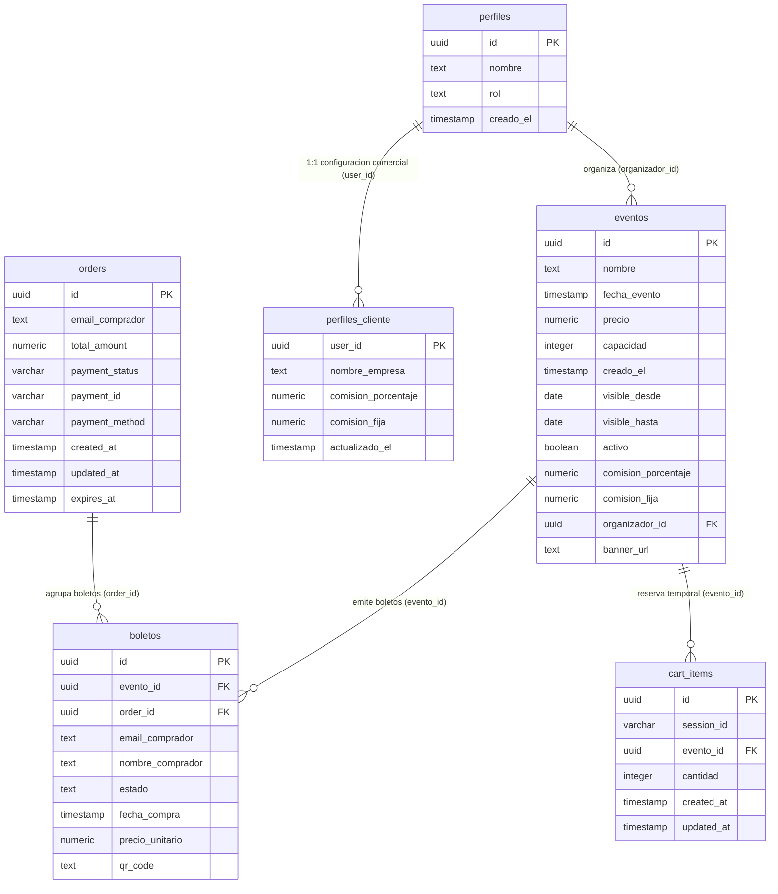

# 🗄️ Esquema Oficial de Base de Datos - Q-Pass Digital Access

Documento generado a partir de la consulta estricta de metadatos en Supabase PostgreSQL.

---

## 📊 Diagrama Entidad-Relación (Mermaid ERD)



---

## 📋 Diccionario de Datos Completo (Campos y Tipos)

### 1. `boletos`
| Columna | Tipo de Dato | Requerido | Descripción |
| :--- | :--- | :---: | :--- |
| `id` | `uuid` | Sí (PK) | Identificador único del boleto |
| `evento_id` | `uuid` | No (FK -> `eventos.id`) | ID del evento al que pertenece |
| `order_id` | `uuid` | No (FK -> `orders.id`) | ID de la orden de compra |
| `email_comprador` | `text` | Sí | Correo electrónico del comprador o asistente |
| `nombre_comprador` | `text` | No | Nombre completo del asistente registrado |
| `estado` | `text` | No | `pending`, `paid`, `activo`, `usado`, `cancelado` |
| `fecha_compra` | `timestamp` | No | Fecha y hora exacta de emisión |
| `precio_unitario` | `numeric` | No | Precio base del boleto individual |
| `qr_code` | `text` | No | Token firmado HMAC para código QR |

### 2. `eventos`
| Columna | Tipo de Dato | Requerido | Descripción |
| :--- | :--- | :---: | :--- |
| `id` | `uuid` | Sí (PK) | Identificador único del evento |
| `nombre` | `text` | Sí | Título o nombre del evento |
| `fecha_evento` | `timestamp` | Sí | Fecha y hora de celebración del evento |
| `precio` | `numeric` | Sí | Precio unitario base de la entrada |
| `capacidad` | `integer` | Sí | Aforo o cantidad máxima de boletos |
| `creado_el` | `timestamp` | No | Fecha de creación del registro |
| `visible_desde` | `date` | No | Fecha inicial de publicación |
| `visible_hasta` | `date` | No | Fecha límite de publicación |
| `activo` | `boolean` | Sí | Estado del evento en plataforma (`true/false`) |
| `comision_porcentaje` | `numeric` | No | Porcentaje de comisión asignado al evento |
| `comision_fija` | `numeric` | No | Monto fijo de comisión asignado al evento |
| `organizador_id` | `uuid` | No | ID del usuario organizador creador |
| `banner_url` | `text` | No | URL o data Base64 del banner promocional |

### 3. `orders`
| Columna | Tipo de Dato | Requerido | Descripción |
| :--- | :--- | :---: | :--- |
| `id` | `uuid` | Sí (PK) | Identificador de la orden de compra |
| `email_comprador` | `text` | Sí | Correo del titular de la orden |
| `total_amount` | `numeric` | Sí | Monto total pagado de la orden |
| `payment_status` | `varchar` | No | Estado del pago (`paid`, `pending`) |
| `payment_id` | `varchar` | No | ID de la transacción en Stripe |
| `payment_method` | `varchar` | No | Método de pago utilizado |
| `created_at` | `timestamp` | No | Fecha de generación de la orden |
| `updated_at` | `timestamp` | No | Última actualización del estado |
| `expires_at` | `timestamp` | No | Expiración de orden pendiente |

### 4. `perfiles`
| Columna | Tipo de Dato | Requerido | Descripción |
| :--- | :--- | :---: | :--- |
| `id` | `uuid` | Sí (PK) | ID del usuario (coincide con `auth.users.id`) |
| `nombre` | `text` | No | Nombre del usuario |
| `rol` | `text` | No | Rol del usuario (`master`, `organizador`, `checador`) |
| `creado_el` | `timestamp` | No | Fecha de creación del perfil |

### 5. `perfiles_cliente`
| Columna | Tipo de Dato | Requerido | Descripción |
| :--- | :--- | :---: | :--- |
| `user_id` | `uuid` | Sí (PK) | ID del usuario socio u organizador |
| `nombre_empresa` | `text` | No | Nombre comercial de la empresa/organizadora |
| `comision_porcentaje` | `numeric` | No | Comisión en % configurada para el socio |
| `comision_fija` | `numeric` | No | Comisión fija en $ configurada para el socio |
| `actualizado_el` | `timestamp` | No | Última actualización |

### 6. `cart_items`
| Columna | Tipo de Dato | Requerido | Descripción |
| :--- | :--- | :---: | :--- |
| `id` | `uuid` | Sí (PK) | ID de elemento en carrito |
| `session_id` | `varchar` | Sí | ID de sesión temporal de compra |
| `evento_id` | `uuid` | No (FK -> `eventos.id`) | ID del evento seleccionado |
| `cantidad` | `integer` | No | Número de entradas seleccionadas |
| `created_at` | `timestamp` | No | Creación |
| `updated_at` | `timestamp` | No | Modificación |

---

## 🔑 Claves Foráneas (Foreign Keys)
- `boletos.evento_id` ➔ `eventos.id`
- `boletos.order_id` ➔ `orders.id`
- `cart_items.evento_id` ➔ `eventos.id`
- `zonas_evento.evento_id` ➔ `eventos.id`

---

## 🛠️ Migración SQL: Zonas de Eventos, Preventas y Mapa de Recinto

Ejecuta el siguiente script en el **SQL Editor de Supabase** para habilitar la tabla de zonas y columnas extendidas:

```sql
-- 1. Crear tabla zonas_evento (Multi-zona / Fases de preventa)
CREATE TABLE IF NOT EXISTS public.zonas_evento (
    id UUID DEFAULT gen_random_uuid() PRIMARY KEY,
    evento_id UUID REFERENCES public.eventos(id) ON DELETE CASCADE,
    nombre TEXT NOT NULL,
    precio NUMERIC NOT NULL DEFAULT 0,
    capacidad INTEGER NOT NULL DEFAULT 100,
    vendidos INTEGER DEFAULT 0,
    descripcion TEXT,
    activo BOOLEAN DEFAULT true,
    creado_el TIMESTAMP WITH TIME ZONE DEFAULT timezone('utc'::text, now())
);

-- RLS para zonas_evento
ALTER TABLE public.zonas_evento ENABLE ROW LEVEL SECURITY;
CREATE POLICY "Lectura pública de zonas de eventos" ON public.zonas_evento FOR SELECT USING (true);
CREATE POLICY "Administración de zonas por organizadores o master" ON public.zonas_evento FOR ALL USING (true);

-- 2. Agregar mapa_zonas_url a la tabla eventos
ALTER TABLE public.eventos ADD COLUMN IF NOT EXISTS mapa_zonas_url TEXT;

-- 3. Agregar zona_id y nombre_zona a la tabla boletos
ALTER TABLE public.boletos ADD COLUMN IF NOT EXISTS zona_id UUID REFERENCES public.zonas_evento(id) ON DELETE SET NULL;
ALTER TABLE public.boletos ADD COLUMN IF NOT EXISTS nombre_zona TEXT;
```
